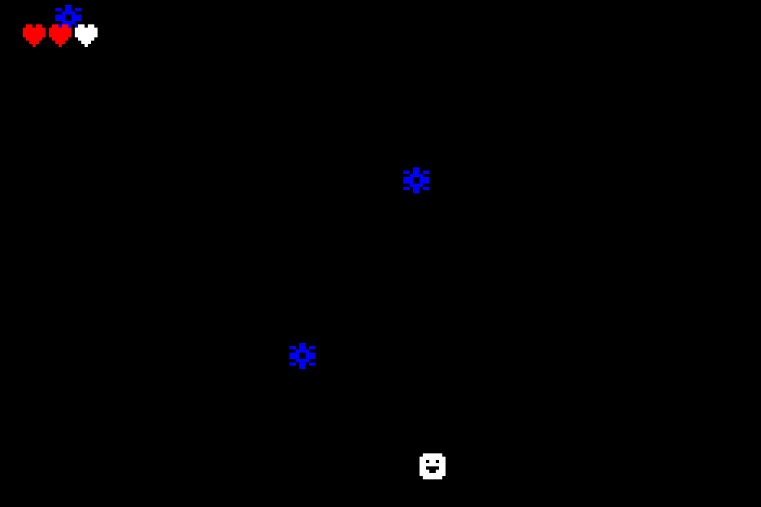

# `asteroids`



This is a simple demonstration of Gameboy Advance game development. It was written in Rust and leans on the `gba` crate for GBA-specific functionality.

## Running Pre-Compiled ROM

A pre-compiled ROM, `asteroids.gba`, is available in the `rom` directory. You can run this ROM on your favorite GBA emulator. I have yet to test on real hardware.

## Building
This project uses the `rust-gba` toolchain. You can install it with

See ../README.md for instructions on how to install the ARM toolchain.

```bash
rustup override set nightly
cargo build --release
```

## Building to ROM file (.gba)
To build the project to a ROM file, you can use the `release-rom.sh` script. This will create a `asteroids.gba` file in the `rom` directory.

```bash
./release-rom.sh
```

## Running

This project uses the `mgba-qt` emulator. You can run the game with

`cargo run`

Please visit https://mgba.io/ for more information on how to install the emulator on your target platform.

## Gameplay Instructions

- Use the D-Pad to left and right to move the player
- Avoid the blue asteroids falling from the top of the screen
- Asteroid speed inscreases as the game progresses
- The player has 3 lives and the game ends when the player runs out of lives
- Press `START` to restart the game once the player has lost all lives
