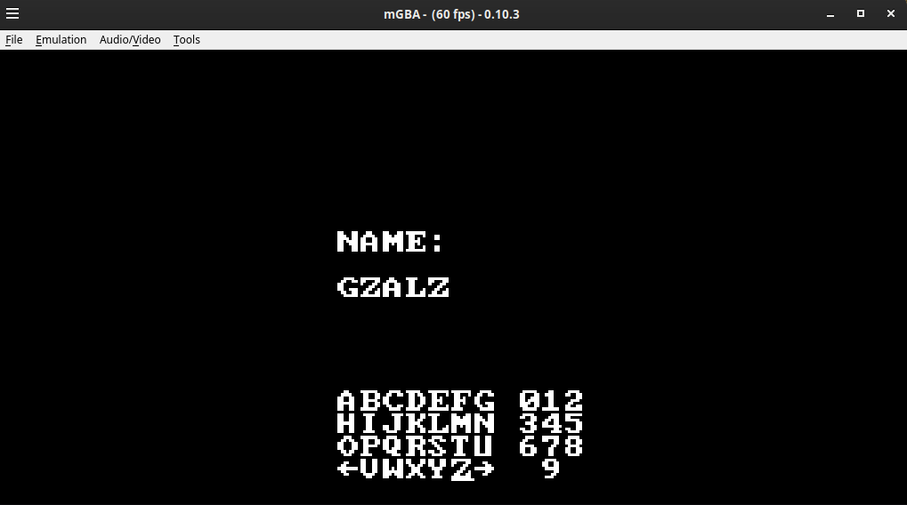

# `keyboard-interface`

This is a simple keyboard interface for the Gameboy Advance. It was written in Rust and leans on the `gba` crate for GBA-specific functionality.

## Running Pre-Compiled ROM

A pre-compiled ROM, `keyboard-interface.gba`, is available in the `rom` directory. You can run this ROM on your favorite GBA emulator. I have yet to test on real hardware.

## Building

`cargo build --release`

## Building to ROM file (.gba)

`./release-rom.sh`

## Running

This project uses the `mgba-qt` emulator. You can run the game with

`cargo run`

Please visit https://mgba.io/ for more information on how to install the emulator on your target platform.

